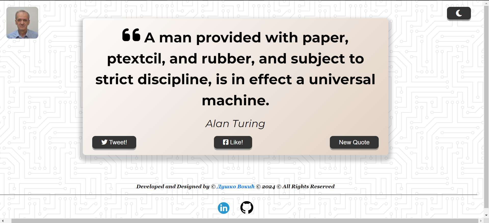

# Quote Generator

You can check it out [here](https://d-vokic.github.io/Quotations-Generator-App/).

## Author

👤 **Duško Vokić**

* LinkedIn: [Here](https://linkedin.com/in/duško-vokić-0337a2106)
* GitHub: [@D-vokic](https://github.com/D-vokic)

Quote Generator is a simple web application designed to generate random quotes. It allows users to press a button and get a new quote they can share or like on social media.

## Usage Instructions

1. Visit the Quote Generator website.
2. Click on the "Generate Quote" button to generate a new quote.
3. Use the "Share" option to share the quote on social media.

## Technologies and Languages

- HTML5
- CSS3 (Sass)
- JavaScript

## Directory Structure

quote-generator/
|_ .gitignore
|_ index.html
|_ README.md
|_ assets/
|_ css/
|_ style.css
|_ scss/
|_ components/
|_ index.css
|_ partials/
|_ 
|_ 
|_ 
|_ 
|_ 
|_ 
|_ style.scss
|_ animations.scss
|_ mixins.scss
|_ variables.scss
|_ js/
|_ script.js
|_ quotes.js
|_ img/
|_ 
|_ 
|_ !
|_ !
|_ !

## License

This project is licensed under the [MIT License](https://www.mit.edu/~amini/LICENSE.md).

## Contact Information

You can contact me via email: vokic.dusko@gmail.com
